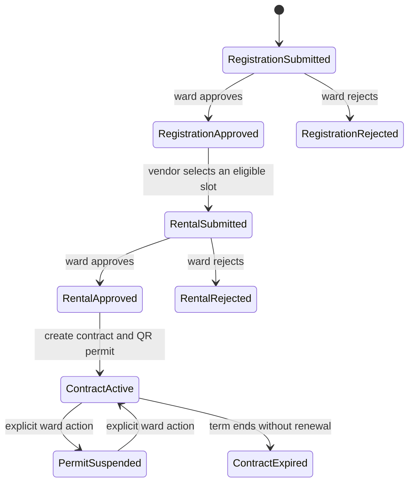

# StreetBiz Backend

The backend API for **StreetBiz**, a ward-level platform for sidewalk-vendor
registration, legal-slot rental, digital permits, fees, penalties, and community
verification.

> **Project status:** requirements and repository initialization. No backend
> solution, database migration, or runtime configuration has been committed yet,
> so this repository is not currently runnable. Scope in this README follows the
> revised SRS baseline dated 30 August 2026.

## Responsibilities

The backend is the authoritative source for identity, registration, sidewalk-slot,
rental-contract, permit, fee, invoice, violation, and penalty state. It will expose
implementation-independent, versioned REST APIs for the StreetBiz frontend.

Planned Core capabilities include:

- Phone/OTP identity, session management, and role-based authorization.
- Fixed Storefront and Itinerant vendor registration with separate evidence rules.
- Independent registration and sidewalk-rental review state machines.
- Ward-scoped slot grids, geofences, pricing, schedules, and availability.
- Rental contracts and QR permits generated after rental approval.
- Live permit verification for ward officers, customers, and guests.
- Per-contract fee schedules, payment reconciliation, and invoice issuance.
- Violation records, configured penalty calculation, and explicit permit actions.
- Renewal, address-change, proposed-slot, conflict, and transfer workflows.
- Ward operational/collection reporting and community-report routing.
- Platform account/category administration, kept separate from ward authority.
- Auditing, notifications, evidence storage, health checks, and operational logs.

## Critical domain flow

Registration approval and rental approval are distinct decisions. A rental may be
approved only for a vendor with an approved registration, and the resulting permit
is valid only while its contract is active and not suspended.

## Planned backend stack

- .NET 8
- REST APIs with a versioned OpenAPI/Swagger contract
- PostgreSQL 16 with forward-only versioned migrations
- Redis as an optional transient cache/event component
- JWT or session-based authentication with strict RBAC
- WebSocket or server-sent events only where real-time behaviour is justified
- Docker/Compose for reproducible local and deployment environments
- GitHub Actions for build, test, migration, dependency, and secret checks

### External integrations

- Phone/OTP provider, with a development stub
- OpenStreetMap-compatible geocoding and map-data provider
- MoMo/ZaloPay sandbox for rental fees and penalties
- Firebase Cloud Messaging or an equivalent notification provider
- Restricted evidence/object storage
- Optional OCR/vision/AI services for the gated Core extension
- Monitoring and error-tracking service

Each provider must sit behind an adapter so it can be mocked, sandboxed, or
replaced without changing the core domain workflow.

## Core invariants

- A slot belongs to exactly one ward and has one current lifecycle status.
- Slot availability is revalidated transactionally when concurrent applications
  target the same slot.
- Rental approval atomically creates the contract and digital permit.
- QR results always resolve against current server-side permit state.
- Fee schedules derive from each contract's start date and selected term.
- An invoice is issued only after an authenticated payment callback succeeds.
- Callback handling is signed, idempotent, replay-resistant, and reconcilable.
- Recording a violation or calculating a penalty does not automatically suspend a
  permit; suspension and revocation are explicit ward actions with a reason.
- Transfers preserve the remaining contract term and fee schedule and are blocked
  while fees or penalties remain unpaid.
- All material state transitions record the actor and timestamp.
- Platform administrators cannot perform ward compliance decisions.

## API and security expectations

- Validate roles, ward scope, and resource ownership on the server for every
  protected request.
- Normalize supported Vietnamese phone numbers and represent money in VND.
- Return standardized success payloads, errors, and HTTP status codes.
- Paginate and filter application, slot, and report collections.
- Restrict identity documents, addresses, and evidence to the owning vendor and
  authorized ward reviewers.
- Never log OTPs, tokens, payment secrets, or unnecessary personal information.
- Keep development, test, staging, and production credentials separate.
- Accept payment success only from verified provider callbacks, never from a
  browser redirect alone.
- Target at least 99.5% pilot availability and a 50-concurrent-user pilot load.

## Getting started

There is no `.sln`, project file, Compose file, migration, or environment template
in the repository yet. Once the service foundation is committed, this section
will provide exact commands for:

1. Installing the pinned .NET SDK and container prerequisites.
2. Creating local configuration from a safe example file.
3. Starting PostgreSQL and optional Redis dependencies.
4. Applying migrations and loading synthetic seed data.
5. Running the API, automated tests, and OpenAPI documentation.

Configuration will cover database connectivity, token/session security, OTP,
maps, payments, notifications, evidence storage, optional AI providers, and
observability. Real credentials and personal data must never be committed.

## Testing and release quality

- At least 70% automated line coverage for backend domain/service packages.
- API and integration coverage for all Core endpoints and negative authorization
  cases.
- Integration adapters exercised through mocks, stubs, or approved sandboxes.
- Explicit tests for duplicate submissions, payment callback replay, concurrent
  slot applications, and permit-state transitions.
- Applicable OWASP ASVS Level 1 checks, with no open High/Critical security defect
  at release.
- Health/readiness endpoints, structured logs, correlation IDs, migration records,
  and a documented backup/restore and rollback procedure.

## Phase boundaries

The Core release covers compliance workflows only. AI compliance support is gated
and advisory. Storefronts, menus, discovery, prepaid food orders, pickup tracking,
reviews, refunds, and marketplace moderation belong to Phase 2. There is no
delivery/shipper network or cash on delivery in any phase.

## Related repository

The responsive PWA and role-specific dashboards live in
[StreetBiz-FE](https://github.com/zawy2004/StreetBiz-FE).

## Contributing

Use a short-lived `feature/<issue>-short-name` or `fix/<issue>-short-name` branch.
Pull requests should identify the requirement, include migration/API compatibility
notes where relevant, provide test evidence and rollback risk, and receive at least
one approval before merge.

## Team

- Dinh Gia Huy — Team Leader
- Nguyen Duy Luong
- Park Jea Minh
- Truong Huynh Long Vien
- Do Thanh Tin
- Nguyen Quoc Long — Supervisor

## Licence

No open-source licence has been published for this repository yet.
